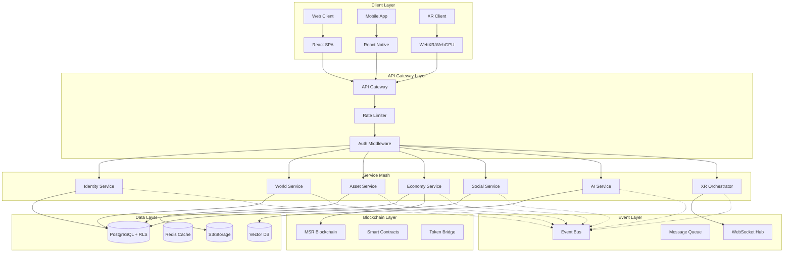
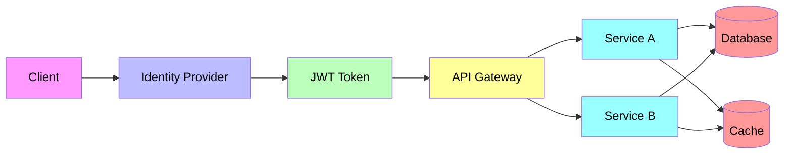

# TAMV MD-X4™ Consolidated Architecture Document

## Executive Summary

This document defines the unified, production-ready architecture for TAMV (Transcendent Autonomous Metaverse Vision) MD-X4™ - a next-generation metaverse ecosystem platform that combines immersive WebXR/WebGPU rendering, AI-driven experiences, blockchain-based economies, and federated security systems.

### Architecture Principles

1. **Modularity First** - Every component is independently deployable and replaceable
2. **Federated by Design** - No single point of failure; distributed across layers
3. **Privacy by Default** - Zero-trust with RLS at database level
4. **Quantum-Ready** - Post-quantum cryptography foundations (Kyber, Dilithium, BB84)
5. **Event-Driven** - Async messaging for loose coupling between services
6. **Observable Everything** - OpenTelemetry instrumentation throughout

---

## 1. System Overview

### 1.1 The Trinity Federated Model

TAMV operates on three inseparable planes:

```
┌─────────────────────────────────────────────────────────────────────┐
│                    TRINITY FEDERATED TAMV                          │
├─────────────────────────────────────────────────────────────────────┤
│                                                                     │
│  ┌──────────────────┐  ┌──────────────────┐  ┌──────────────────┐ │
│  │   TECHNICAL      │  │   DOCUMENTAL      │  │   ETHICAL        │ │
│  │   PLANE          │  │   PLANE (PRISMA)  │  │   PLANE (EOCT)   │ │
│  │                  │  │                  │  │                  │ │
│  │ • Microservices  │  │ • PrismaRecords   │  │ • Ethics Filter  │ │
│  │ • XR Rendering   │  │ • EvidenceSources │  │ • Risk Analysis  │ │
│  │ • Blockchain     │  │ • DecisionRecords │  │ • Compliance     │ │
│  │ • Security       │  │ • BookPI          │  │ • Auditing       │ │
│  └────────┬─────────┘  └────────┬─────────┘  └────────┬─────────┘ │
│           │                     │                     │           │
│           └─────────────────────┼─────────────────────┘           │
│                                 ▼                                   │
│                    ┌──────────────────────┐                       │
│                    │   CONSTITUTIONAL      │                       │
│                    │   CIVILIZATIONAL      │                       │
│                    │   CONTRACT (C³)       │                       │
│                    └──────────────────────┘                       │
└─────────────────────────────────────────────────────────────────────┘
```

### 1.2 High-Level Architecture Diagram



---

## 2. Frontend Architecture

### 2.1 Technology Stack

| Layer | Technology | Version | Purpose |
|-------|------------|---------|---------|
| Framework | React | 18.3+ | UI Framework |
| Language | TypeScript | 5.x | Type Safety |
| Build Tool | Vite | 7.x | Fast Builds |
| Styling | TailwindCSS | 3.x | Utility CSS |
| Components | Radix UI + shadcn/ui | Latest | Accessible Components |
| State | Zustand + React Query | Latest | Client State + Server State |
| Forms | React Hook Form + Zod | Latest | Form Handling + Validation |
| 3D/XR | Three.js + @react-three/fiber | Latest | Immersive Rendering |
| Routing | React Router | 6.x | Client Routing |
| Animations | Framer Motion | 11.x | Complex Animations |

### 2.2 Folder Structure (Monorepo)

```
tamv-mdx4/
├── apps/
│   ├── web/                    # Main React SPA
│   │   ├── src/
│   │   │   ├── app/            # App router pages
│   │   │   ├── pages/          # Traditional pages
│   │   │   ├── components/     # Feature components
│   │   │   ├── hooks/          # Custom hooks
│   │   │   ├── lib/            # Utilities
│   │   │   ├── stores/         # Zustand stores
│   │   │   └── styles/         # Global styles
│   │   └── index.html
│   │
│   ├── mobile/                 # React Native (future)
│   └── xr/                     # WebXR Client (future)
│
├── packages/
│   ├── ui/                     # Shared UI components
│   ├── config/                # Shared configuration
│   ├── types/                 # Shared TypeScript types
│   ├── utils/                 # Shared utilities
│   ├── api-client/            # API client library
│   └── auth/                  # Authentication library
│
├── services/                  # Backend microservices
│   ├── identity/              # User & auth service
│   ├── world/                 # World/scene management
│   ├── asset/                # Asset management
│   ├── economy/              # Credits & transactions
│   ├── social/               # Social features
│   ├── ai/                   # AI services (Isabella)
│   ├── xr/                   # XR orchestration
│   └── gateway/              # API Gateway
│
├── libs/
│   ├── blockchain/           # MSR Blockchain client
│   ├── quantum/              # Quantum crypto utilities
│   └── federation/           # Federation utilities
│
├── tools/
│   ├── scripts/               # Build/deploy scripts
│   ├── testing/              # Test utilities
│   └── migration/            # DB migrations
│
├── docs/                      # Documentation
│   ├── api/                   # API specifications
│   ├── architecture/         # Architecture docs
│   ├── protocols/            # Protocol definitions
│   └── guides/               # How-to guides
│
└── tests/                     # Test suites
    ├── unit/
    ├── integration/
    └── e2e/
```

### 2.3 Component Patterns

#### Atomic Design Implementation

```
components/
├── atoms/                     # Basic building blocks
│   ├── Button/
│   ├── Input/
│   ├── Avatar/
│   └── Badge/
│
├── molecules/                 # Simple component groups
│   ├── SearchBar/
│   ├── UserCard/
│   └── AssetThumbnail/
│
├── organisms/                 # Complex UI sections
│   ├── Header/
│   ├── Sidebar/
│   └── WorldViewer/
│
├── templates/                 # Page layouts
│   ├── AuthLayout/
│   ├── DashboardLayout/
│   └── WorldLayout/
│
└── pages/                     # Full pages
    ├── Home/
    ├── Profile/
    └── World/
```

#### Component Interface Pattern

```typescript
// Example: Atom component interface
interface ButtonProps extends React.ButtonHTMLAttributes<HTMLButtonElement> {
  variant?: 'primary' | 'secondary' | 'ghost' | 'danger';
  size?: 'sm' | 'md' | 'lg' | 'icon';
  isLoading?: boolean;
  leftIcon?: React.ReactNode;
  rightIcon?: React.ReactNode;
}

// Example: Organism component interface
interface WorldViewerProps {
  worldId: string;
  initialPosition?: Vector3;
  cameraMode?: 'firstPerson' | 'thirdPerson' | 'orbit';
  enablePhysics?: boolean;
  enableAudio?: boolean;
  onWorldLoad?: (world: World) => void;
  onInteraction?: (event: WorldEvent) => void;
}
```

### 2.4 State Management

#### Global State (Zustand)

```typescript
// stores/userStore.ts
interface UserState {
  user: User | null;
  profile: Profile | null;
  preferences: UserPreferences;
  credits: number;
  isAuthenticated: boolean;
  
  // Actions
  setUser: (user: User | null) => void;
  updateCredits: (amount: number) => void;
  updatePreferences: (prefs: Partial<UserPreferences>) => void;
}

// stores/worldStore.ts
interface WorldState {
  activeWorld: World | null;
  worlds: World[];
  worldSettings: WorldSettings;
  
  // Actions
  loadWorld: (worldId: string) => Promise<void>;
  updateWorldSettings: (settings: Partial<WorldSettings>) => void;
}
```

#### Server State (React Query)

```typescript
// hooks/useWorlds.ts
export function useWorlds(filters?: WorldFilters) {
  return useQuery({
    queryKey: ['worlds', filters],
    queryFn: () => api.worlds.list(filters),
    staleTime: 30000,
    gcTime: 5 * 60 * 1000,
  });
}

// hooks/useAssets.ts
export function useAssets(worldId: string) {
  return useInfiniteQuery({
    queryKey: ['assets', worldId],
    queryFn: ({ pageParam }) => api.assets.list({ worldId, cursor: pageParam }),
    getNextPageParam: (lastPage) => lastPage.nextCursor,
  });
}
```

### 2.5 Internationalization (i18n)

```typescript
// i18n configuration
import i18n from 'i18next';
import { initReactI18next } from 'react-i18next';

i18n
  .use(initReactI18next)
  .init({
    resources: {
      en: { translation: en },
      es: { translation: es },
      zh: { translation: zh },
      ja: { translation: ja },
    },
    fallbackLng: 'en',
    defaultNS: 'common',
    ns: ['common', 'world', 'social', 'economy'],
    interpolation: {
      escapeValue: false,
    },
    react: {
      useSuspense: false,
    },
  });
```

### 2.6 Accessibility (a11y)

- WCAG 2.1 AA compliance
- ARIA labels on all interactive elements
- Keyboard navigation support
- Screen reader optimizations
- Focus management for modals/dialogs
- Reduced motion support

---

## 3. Backend Architecture

### 3.1 Microservices Design

#### Service Catalog

| Service | Port | Protocol | Database | Cache | Description |
|---------|------|----------|----------|-------|-------------|
| identity | 3001 | REST/gRPC | PostgreSQL | Redis | User auth, profiles, sessions |
| world | 3002 | REST/gRPC | PostgreSQL + S3 | Redis | Worlds, scenes, assets |
| asset | 3003 | REST/gRPC | PostgreSQL + S3 | Redis | Asset management, CDN |
| economy | 3004 | REST/gRPC | PostgreSQL | Redis | Credits, transactions, payments |
| social | 3005 | REST/gRPC + WS | PostgreSQL | Redis | Posts, comments, relationships |
| ai | 3006 | REST/gRPC | PostgreSQL + Vector | - | Isabella AI, recommendations |
| xr | 3007 | REST/gRPC + WS | PostgreSQL | Redis | XR sessions, synchronization |
| gateway | 3000 | REST/GraphQL | - | Redis | API Gateway, rate limiting |
| notification | 3008 | REST | PostgreSQL | Redis | Push, email, in-app |
| analytics | 3009 | REST | ClickHouse | - | Events, metrics |

### 3.2 API Design Standards

#### REST Endpoints Pattern

```
GET    /api/v1/{resource}              # List with pagination & filters
GET    /api/v1/{resource}/:id          # Get single resource
POST   /api/v1/{resource}              # Create new resource
PATCH  /api/v1/{resource}/:id          # Partial update
DELETE /api/v1/{resource}/:id          # Soft delete
POST   /api/v1/{resource}/:id/action   # Perform action

# Nested resources
GET    /api/v1/worlds/:worldId/assets
POST   /api/v1/worlds/:worldId/assets
GET    /api/v1/users/:userId/posts
```

#### Response Format

```typescript
// Success response
interface ApiResponse<T> {
  success: true;
  data: T;
  meta?: {
    page: number;
    limit: number;
    total: number;
    totalPages: number;
  };
  timestamp: string;
}

// Error response
interface ApiError {
  success: false;
  error: {
    code: string;
    message: string;
    details?: Record<string, unknown>;
    field?: string;
  };
  timestamp: string;
  requestId: string;
}

// Paginated response
interface PaginatedResponse<T> extends ApiResponse<T[]> {
  meta: {
    page: number;
    limit: number;
    total: number;
    totalPages: number;
    hasMore: boolean;
    nextCursor?: string;
  };
}
```

### 3.3 Database Schema (PostgreSQL + RLS)

#### Core Tables

```sql
-- Users and Identity
CREATE TABLE users (
    id UUID PRIMARY KEY DEFAULT gen_random_uuid(),
    email VARCHAR(255) UNIQUE NOT NULL,
    username VARCHAR(50) UNIQUE NOT NULL,
    password_hash VARCHAR(255) NOT NULL,
    wallet_address VARCHAR(66),
    is_verified BOOLEAN DEFAULT false,
    risk_score INTEGER DEFAULT 0,
    created_at TIMESTAMPTZ DEFAULT NOW(),
    updated_at TIMESTAMPTZ DEFAULT NOW()
);

-- Row Level Security Policies
ALTER TABLE users ENABLE ROW LEVEL SECURITY;

-- Users can read public profiles
CREATE POLICY "Public profiles are viewable by everyone"
    ON profiles FOR SELECT
    USING (true);

-- Users can update own profile
CREATE POLICY "Users can update own profile"
    ON profiles FOR UPDATE
    USING (auth.uid() = user_id);

-- Worlds
CREATE TABLE worlds (
    id UUID PRIMARY KEY DEFAULT gen_random_uuid(),
    owner_id UUID REFERENCES users(id) ON DELETE CASCADE,
    title VARCHAR(255) NOT NULL,
    description TEXT,
    scene_data JSONB NOT NULL DEFAULT '{}',
    world_type WORLD_TYPE NOT NULL,
    is_public BOOLEAN DEFAULT true,
    max_players INTEGER DEFAULT 100,
    entrance_fee INTEGER DEFAULT 0,
    metadata JSONB DEFAULT '{}',
    created_at TIMESTAMPTZ DEFAULT NOW(),
    updated_at TIMESTAMPTZ DEFAULT NOW()
);

-- Assets
CREATE TABLE assets (
    id UUID PRIMARY KEY DEFAULT gen_random_uuid(),
    owner_id UUID REFERENCES users(id) ON DELETE CASCADE,
    world_id UUID REFERENCES worlds(id) ON DELETE SET NULL,
    name VARCHAR(255) NOT NULL,
    description TEXT,
    asset_type ASSET_TYPE NOT NULL,
    storage_url TEXT NOT NULL,
    thumbnail_url TEXT,
    metadata JSONB DEFAULT '{}',
    price INTEGER,
    is_for_sale BOOLEAN DEFAULT false,
    created_at TIMESTAMPTZ DEFAULT NOW()
);

-- Economy
CREATE TABLE credit_transactions (
    id UUID PRIMARY KEY DEFAULT gen_random_uuid(),
    user_id UUID REFERENCES users(id) ON DELETE CASCADE,
    amount INTEGER NOT NULL,
    transaction_type TRANSACTION_TYPE NOT NULL,
    reference_id UUID,
    reference_type VARCHAR(50),
    description TEXT,
    metadata JSONB DEFAULT '{}',
    created_at TIMESTAMPTZ DEFAULT NOW()
);

-- Social
CREATE TABLE posts (
    id UUID PRIMARY KEY DEFAULT gen_random_uuid(),
    user_id UUID REFERENCES users(id) ON DELETE CASCADE,
    world_id UUID REFERENCES worlds(id) ON DELETE SET NULL,
    content TEXT NOT NULL,
    media_urls TEXT[],
    post_type POST_TYPE NOT NULL,
    visibility VISIBILITY NOT NULL DEFAULT 'public',
    resonance_count INTEGER DEFAULT 0,
    comment_count INTEGER DEFAULT 0,
    created_at TIMESTAMPTZ DEFAULT NOW()
);
```

### 3.4 Caching Strategy

```typescript
// Redis key patterns
const CacheKeys = {
  user: (id: string) => `user:${id}`,
  userProfile: (id: string) => `profile:${id}`,
  world: (id: string) => `world:${id}`,
  worldList: (filters: string) => `worlds:list:${filters}`,
  asset: (id: string) => `asset:${id}`,
  trending: (type: string) => `trending:${type}`,
  feed: (userId: string, page: number) => `feed:${userId}:${page}`,
};

// Cache TTL values (in seconds)
const CacheTTL = {
  user: 3600,           // 1 hour
  profile: 1800,        // 30 minutes
  world: 600,           // 10 minutes
  worldList: 300,       // 5 minutes
  asset: 7200,          // 2 hours
  trending: 60,         // 1 minute
  feed: 300,            // 5 minutes
};
```

### 3.5 Event-Driven Architecture

#### Event Bus Design

```typescript
// Event types
type TamvEvent =
  | UserEvent
  | WorldEvent
  | AssetEvent
  | EconomyEvent
  | SocialEvent
  | XREvent
  | SystemEvent;

// Example events
interface UserEvent {
  type: 'USER_CREATED' | 'USER_UPDATED' | 'USER_VERIFIED' | 'USER_SUSPENDED';
  timestamp: string;
  userId: string;
  payload: Record<string, unknown>;
}

interface WorldEvent {
  type: 'WORLD_CREATED' | 'WORLD_UPDATED' | 'WORLD_DELETED' | 'PLAYER_JOINED' | 'PLAYER_LEFT';
  timestamp: string;
  worldId: string;
  userId?: string;
  payload: Record<string, unknown>;
}

interface EconomyEvent {
  type: 'CREDIT_PURCHASED' | 'CREDIT_SPENT' | 'ASSET_SOLD' | 'WORLD_ENTERED';
  timestamp: string;
  userId: string;
  amount: number;
  payload: Record<string, unknown>;
}
```

#### Event Handler Pattern

```typescript
// Base event handler interface
interface EventHandler<T extends TamvEvent> {
  handle(event: T): Promise<void>;
  onFailure(event: T, error: Error): Promise<void>;
}

// Example: World event handler
class WorldEventHandler implements EventHandler<WorldEvent> {
  async handle(event: WorldEvent): Promise<void> {
    switch (event.type) {
      case 'WORLD_CREATED':
        await this.handleWorldCreated(event);
        break;
      case 'PLAYER_JOINED':
        await this.handlePlayerJoined(event);
        break;
      // ...
    }
  }

  private async handleWorldCreated(event: WorldEvent): Promise<void> {
    // Update search index
    await searchIndex.indexWorld(event.worldId, event.payload);
    // Notify followers
    await notificationService.notifyFollowers(event.userId!, 'NEW_WORLD');
    // Update analytics
    await analytics.trackEvent('world_created', { worldId: event.worldId });
  }
}
```

---

## 4. Infrastructure Architecture

### 4.1 Container Orchestration (Kubernetes)

```yaml
# Kubernetes deployment example
apiVersion: apps/v1
kind: Deployment
metadata:
  name: tamv-identity-service
  labels:
    app: tamv
    service: identity
spec:
  replicas: 3
  selector:
    matchLabels:
      service: identity
  template:
    metadata:
      labels:
        service: identity
    spec:
      containers:
      - name: identity-service
        image: tamv/identity-service:latest
        ports:
        - containerPort: 3001
        env:
        - name: DATABASE_URL
          valueFrom:
            secretKeyRef:
              name: tamv-secrets
              key: database-url
        - name: REDIS_URL
          valueFrom:
            configMapKeyRef:
              name: tamv-config
              key: redis-url
        resources:
          requests:
            memory: "256Mi"
            cpu: "250m"
          limits:
            memory: "512Mi"
            cpu: "500m"
                 httpGet:
            path: / livenessProbe:
health
            port: 3001
          initialDelaySeconds: 30
          periodSeconds: 10
        readinessProbe:
          httpGet:
            path: /ready
            port: 3001
          initialDelaySeconds: 5
          periodSeconds: 5
```

### 4.2 Service Mesh

```yaml
# Istio VirtualService for canary deployments
apiVersion: networking.istio.io/v1beta1
kind: VirtualService
metadata:
  name: tamv-world-service
spec:
  hosts:
  - world-service
  http:
  - route:
    - destination:
        host: world-service
        subset: stable
      weight: 90
    - destination:
        host: world-service
        subset: canary
      weight: 10
    retries:
      attempts: 3
      perTryTimeout: 2s
      retryOn: 5xx,reset,connect-failure
    timeout: 30s
```

### 4.3 CI/CD Pipeline

```yaml
# GitHub Actions workflow
name: TAMV CI/CD

on:
  push:
    branches: [main, develop]
  pull_request:
    branches: [main]

env:
  REGISTRY: ghcr.io
  IMAGE_NAME: ${{ github.repository }}

jobs:
  test:
    runs-on: ubuntu-latest
    steps:
      - uses: actions/checkout@v4
      
      - name: Setup Node.js
        uses: actions/setup-node@v4
        with:
          node-version: '20'
          cache: 'npm'
      
      - name: Install dependencies
        run: npm ci
      
      - name: Run type check
        run: npm run typecheck
      
      - name: Run linter
        run: npm run lint
      
      - name: Run unit tests
        run: npm run test:unit
      
      - name: Run integration tests
        run: npm run test:integration

  build:
    needs: test
    runs-on: ubuntu-latest
    steps:
      - uses: actions/checkout@v4
      
      - name: Build Docker images
        run: |
          docker build -t ${{ env.REGISTRY }}/${{ env.IMAGE_NAME }}:${{ github.sha }} .
      
      - name: Run security scan
        run: docker scan ${{ env.REGISTRY }}/${{ env.IMAGE_NAME }}:${{ github.sha }}
      
      - name: Push to registry
        run: |
          echo "${{ secrets.GITHUB_TOKEN }}" | docker login ghcr.io -u ${{ github.actor }} --password-stdin
          docker push ${{ env.REGISTRY }}/${{ env.IMAGE_NAME }}:${{ github.sha }}

  deploy:
    needs: build
    if: github.ref == 'refs/heads/main'
    runs-on: ubuntu-latest
    steps:
      - name: Deploy to production
        run: |
          kubectl set image deployment/ tamv-${{ matrix.service }}=${{ env.REGISTRY }}/${{ env.IMAGE_NAME }}:${{ github.sha }}
```

### 4.4 Observability Stack

```yaml
# OpenTelemetry configuration
otlp:
  endpoint: "http://tempo:4317"
  headers:
    x-tenant-id: tamv-prod

# Metrics
metrics:
  prometheus:
    enabled: true
    port: 9090
    path: /metrics

# Logging
logging:
  level: info
  format: json
  sampling:
    initial: 100
    thereafter: 100

# Tracing
tracing:
  enabled: true
  sampleRate: 0.1
  propagators:
    - b3
    - tracecontext
```

---

## 5. Security Architecture

### 5.1 Zero-Trust Model



### 5.2 Authentication Flow

```typescript
// Authentication flow
interface AuthFlow {
  // Step 1: User initiates login
  login(email: string, password: string): Promise<AuthChallenge>;
  
  // Step 2: User completes MFA if enabled
  verifyMFA(challengeId: string, code: string): Promise<JWT tokens>;
  
  // Step 3: Generate session tokens
  refreshToken(refreshToken: string): Promise<AccessToken>;
  
  // Step 4: Validate token on each request
  validateToken(token: string): Promise<TokenClaims>;
}

// Token structure
interface TokenClaims {
  sub: string;           // User ID
  email: string;
  roles: string[];
  permissions: string[];
  tenantId?: string;
  iat: number;
  exp: number;
}
```

### 5.3 Authorization (RBAC + ABAC)

```typescript
// RBAC Roles
const Roles = {
  USER: 'user',
  CREATOR: 'creator',
  MODERATOR: 'moderator',
  ADMIN: 'admin',
  SUPER_ADMIN: 'super_admin',
} as const;

// Permissions
const Permissions = {
  // World permissions
  WORLD_CREATE: 'world:create',
  WORLD_EDIT_OWN: 'world:edit_own',
  WORLD_EDIT_ALL: 'world:edit_all',
  WORLD_DELETE_OWN: 'world:delete_own',
  WORLD_DELETE_ALL: 'world:delete_all',
  
  // Asset permissions
  ASSET_UPLOAD: 'asset:upload',
  ASSET_EDIT_OWN: 'asset:edit_own',
  ASSET_SELL: 'asset:sell',
  
  // Economy permissions
  TRANSACTION_CREATE: 'transaction:create',
  TRANSACTION_VIEW_OWN: 'transaction:view_own',
  TRANSACTION_VIEW_ALL: 'transaction:view_all',
  
  // Admin permissions
  USER_SUSPEND: 'user:suspend',
  SYSTEM_CONFIG: 'system:config',
} as const;

// ABAC Policy example
interface AccessPolicy {
  effect: 'allow' | 'deny';
  principals: string[];
  actions: string[];
  resources: string[];
  conditions: {
    timeWindow?: { start: string; end: string };
    ipRange?: string;
    mfaVerified?: boolean;
    riskScore?: { operator: 'lt' | 'gt'; value: number };
  };
}
```

### 5.4 Encryption

```typescript
// Encryption interfaces
interface EncryptionService {
  // Symmetric encryption (AES-256-GCM)
  encrypt(plaintext: string, keyId: string): Promise<EncryptedData>;
  decrypt(encrypted: EncryptedData): Promise<string>;
  
  // Asymmetric encryption (Kyber/ML-KEM)
  encryptForRecipient(plaintext: string, recipientPublicKey: string): Promise<EncryptedData>;
  
  // Quantum-safe signing (Dilithium)
  sign(data: string, privateKeyId: string): Promise<Signature>;
  verify(data: string, signature: Signature): Promise<boolean>;
}

// Key rotation
interface KeyRotationService {
  rotateKey(keyId: string): Promise<NewKey>;
  scheduleRotation(keyId: string, interval: number): void;
  getCurrentKey(keyType: KeyType): Promise<Key>;
}
```

### 5.5 Network Security

```yaml
# Network Policies
apiVersion: networking.k8s.io/v1
kind: NetworkPolicy
metadata:
  name: tamv-service-network-policy
spec:
  podSelector:
    matchLabels:
      app: tamv
  policyTypes:
    - Ingress
    - Egress
  ingress:
    - from:
        - podSelector:
            matchLabels:
              app: tamv
      ports:
        - protocol: TCP
          port: 3000
    - from:
        - namespaceSelector:
            matchLabels:
              name: ingress-nginx
      ports:
        - protocol: TCP
          port: 3000
  egress:
    - to:
        - podSelector:
            matchLabels:
              app: tamv-database
      ports:
        - protocol: TCP
          port: 5432
    - to:
        - podSelector:
            matchLabels:
              app: tamv-redis
      ports:
        - protocol: TCP
          port: 6379
```

---

## 6. AI Integration Architecture

### 6.1 Isabella AI Core

```typescript
// Isabella AI Architecture
interface IsabellaCore {
  // Memory system
  memoryVector: VectorDatabase;
  episodicMemory: TimeSeriesDB;
  semanticMemory: KnowledgeGraph;
  
  // Language model
  model: TAMVTransformer;
  
  // Emotional intelligence
  emotionalEngine: EmotionEngine;
  
  // Capabilities
  processInteraction(input: UserInput): Promise<IsabellaResponse>;
  analyzeEmotion(context: EmotionalContext): Promise<EmotionAnalysis>;
  generateNarrative(prompt: NarrativePrompt): Promise<Narrative>;
  moderateContent(content: string): Promise<ModerationResult>;
}

// Emotion Engine
interface EmotionEngine {
  detectEmotion(text: string): Promise<EmotionVector>;
  adaptResponse(response: string, emotion: EmotionVector): string;
  generateEmpatheticResponse(situation: Situation): Promise<Response>;
}
```

### 6.2 AI Service Integrations

```typescript
// AI Provider abstraction
interface AIProvider {
  // Text generation
  generate(prompt: GenerationPrompt): Promise<GenerationResponse>;
  
  // Embeddings
  embed(text: string[]): Promise<number[][]>;
  
  // Image generation
  generateImage(prompt: ImagePrompt): Promise<ImageResult>;
  
  // Moderation
  moderate(content: string): Promise<ModerationResult>;
}

// Provider implementations
class OpenAIProvider implements AIProvider { /* ... */ }
class AnthropicProvider implements AIProvider { /* ... */ }
class LocalProvider implements AIProvider { /* ... */ }
class IsabellaLocalProvider implements AIProvider { /* ... */ }
```

### 6.3 Content Moderation

```typescript
interface ModerationService {
  // Pre-moderation (before content is stored)
  preModerate(content: Content): Promise<ModerationResult>;
  
  // Post-moderation (async, after storage)
  postModerate(contentId: string): Promise<ModerationResult>;
  
  // User reporting
  processReport(report: UserReport): Promise<void>;
  
  // Appeal process
  appealDecision(appeal: Appeal): Promise<AppealResult>;
}
```

---

## 7. XR/WebGPU Integration

### 7.1 WebXR Pipeline

```typescript
// WebXR Session management
interface XRSessionManager {
  // Session lifecycle
  async startSession(config: XRConfig): Promise<XRSession>;
  async endSession(sessionId: string): Promise<void>;
  
  // Rendering
  async renderFrame(frame: XRFrame): Promise<void>;
  
  // Input
  onInputSourceAdded(callback: (source: XRInputSource) => void): void;
  onInputSourceRemoved(callback: (source: XRInputSource) => void): void;
  
  // Teleportation
  async teleportTo(position: Vector3, rotation: Quaternion): Promise<void>;
}

// XR Config
interface XRConfig {
  mode: 'vr' | 'ar' | 'mr';
  referenceSpace: 'local' | 'local-floor' | 'bounded' | 'unbounded';
  optionalFeatures: string[];
  requiredFeatures: string[];
  renderScale: number;
  foveation: number;
}
```

### 7.2 WebGPU Rendering

```typescript
// WebGPU Renderer interface
interface WebGPURenderer {
  // Pipeline setup
  createRenderPipeline(config: PipelineConfig): GPURenderPipeline;
  createComputePipeline(config: ComputePipelineConfig): GPUComputePipeline;
  
  // Asset streaming
  streamAsset(assetId: string): Promise<GPUResource>;
  
  // Dynamic LOD
  updateLOD(cameraPosition: Vector3): void;
  
  // Global illumination
  computeGI(scene: Scene): Promise<GIResult>;
  
  // Physics simulation
  simulatePhysics(scene: Scene, deltaTime: number): Promise<PhysicsResult>;
}

// Asset streaming
interface AssetStreamingManager {
  async loadWorld(worldId: string, options: StreamingOptions): Promise<void>;
  async prioritizeAssets(priorities: AssetPriority[]): void;
  onProgress(callback: (progress: StreamingProgress) => void): void;
}
```

### 7.3 Multi-Device Support

```typescript
// Device capability detection
interface DeviceCapabilities {
  // Rendering
  maxTextureSize: number;
  supportsWebGPU: boolean;
  supportsWebXR: boolean;
  supportsHardwareScaling: boolean;
  
  // Input
  supportsHandTracking: boolean;
  supportsEyeTracking: boolean;
  supportsControllers: boolean;
  
  // Performance
  gpuTier: 'low' | 'medium' | 'high';
  recommendedRenderScale: number;
}

// Adaptive rendering based on device
function adaptRendering(config: RenderConfig, capabilities: DeviceCapabilities): RenderConfig {
  if (!capabilities.supportsWebGPU) {
    return { ...config, renderer: 'webgl' };
  }
  
  return {
    ...config,
    renderScale: capabilities.recommendedRenderScale,
    foveation: capabilities.gpuTier === 'low' ? 0 : 1,
    shadowQuality: capabilities.gpuTier === 'low' ? 'low' : 'high',
  };
}
```

---

## 8. Blockchain Integration (MSR)

### 8.1 MSR Blockchain Architecture

```typescript
// MSR Blockchain client
interface MSRBlockchain {
  // Transaction operations
  async createTransaction(tx: Transaction): Promise<TransactionReceipt>;
  async getTransaction(txHash: string): Promise<Transaction>;
  async getBalance(address: string): Promise<BigNumber>;
  
  // Smart contract interaction
  async callContract(contract: string, method: string, args: any[]): Promise<any>;
  async submitContract(contract: string, bytecode: string): Promise<string>;
  
  // Block operations
  async getBlock(blockNumber: number): Promise<Block>;
  async getLatestBlock(): Promise<Block>;
  
  // Consensus
  async submitBlock(block: Block): Promise<void>;
  async validateBlock(block: Block): Promise<boolean>;
}

// MSR Token
interface MSRToken {
  transfer(to: string, amount: BigNumber): Promise<TransactionReceipt>;
  approve(spender: string, amount: BigNumber): Promise<TransactionReceipt>;
  balanceOf(owner: string): Promise<BigNumber>;
  allowance(owner: string, spender: string): Promise<BigNumber>;
}
```

### 8.2 Smart Contract Types

```typescript
// Token contract
interface TokenContract {
  name: string;
  symbol: string;
  decimals: number;
  totalSupply: BigNumber;
  transfer(to: string, amount: BigNumber): Transaction;
  approve(spender: string, amount: BigNumber): Transaction;
}

// NFT Contract (Soul-bound for identity)
interface SoulBoundNFT {
  mint(to: string, tokenURI: string, metadata: NFTMetadata): Transaction;
  burn(tokenId: BigNumber): Transaction;
  tokenURI(tokenId: BigNumber): string;
  isTransferable(tokenId: BigNumber): boolean;
}

// Marketplace Contract
interface MarketplaceContract {
  listAsset(assetId: string, price: BigNumber): Transaction;
  buyAsset(assetId: string, buyer: string): Transaction;
  cancelListing(assetId: string): Transaction;
  setRoyalty(royaltyBps: number): Transaction;
}
```

---

## 9. API Specifications

### 9.1 Authentication API

```yaml
openapi: 3.0.0
info:
  title: TAMV Identity API
  version: 1.0.0
paths:
  /auth/register:
    post:
      summary: Register new user
      requestBody:
        required: true
        content:
          application/json:
            schema:
              type: object
              required:
                - email
                - username
                - password
              properties:
                email:
                  type: string
                  format: email
                username:
                  type: string
                  minLength: 3
                  maxLength: 50
                password:
                  type: string
                  minLength: 8
      responses:
        '201':
          description: User created
          content:
            application/json:
              schema:
                $ref: '#/components/schemas/User'
        '400':
          $ref: '#/components/responses/ValidationError'
        '409':
          $ref: '#/components/responses/Conflict'

  /auth/login:
    post:
      summary: User login
      requestBody:
        required: true
        content:
          application/json:
            schema:
              type: object
              required:
                - email
                - password
              properties:
                email:
                  type: string
                password:
                  type: string
      responses:
        '200':
          description: Login successful
          content:
            application/json:
              schema:
                type: object
                properties:
                  accessToken:
                    type: string
                  refreshToken:
                    type: string
                  expiresIn:
                    type: integer
        '401':
          $ref: '#/components/responses/Unauthorized'
```

### 9.2 Worlds API

```yaml
paths:
  /worlds:
    get:
      summary: List worlds
      parameters:
        - name: type
          in: query
          schema:
            type: string
            enum: [gallery, concert, meeting, game, meditation, custom]
        - name: page
          in: query
          schema:
            type: integer
            default: 1
        - name: limit
          in: query
          schema:
            type: integer
            default: 20
            maximum: 100
      responses:
        '200':
          description: Worlds list
          content:
            application/json:
              schema:
                $ref: '#/components/schemas/WorldList'

    post:
      summary: Create world
      security:
        - BearerAuth: []
      requestBody:
        required: true
        content:
          application/json:
            schema:
              $ref: '#/components/schemas/CreateWorld'
      responses:
        '201':
          description: World created
          content:
            application/json:
              schema:
                $ref: '#/components/schemas/World'
        '401':
          $ref: '#/components/responses/Unauthorized'

  /worlds/{worldId}:
    get:
      summary: Get world details
      parameters:
        - name: worldId
          in: path
          required: true
          schema:
            type: string
            format: uuid
      responses:
        '200':
          description: World details
          content:
            application/json:
              schema:
                $ref: '#/components/schemas/World'
        '404':
          $ref: '#/components/responses/NotFound'

    patch:
      summary: Update world
      security:
        - BearerAuth: []
      parameters:
        - name: worldId
          in: path
          required: true
          schema:
            type: string
      responses:
        '200':
          description: World updated

    delete:
      summary: Delete world
      security:
        - BearerAuth: []
      responses:
        '204':
          description: World deleted

  /worlds/{worldId}/join:
    post:
      summary: Join world
      security:
        - BearerAuth: []
      responses:
        '200':
          description: Joined successfully
          content:
            application/json:
              schema:
                $ref: '#/components/schemas/WorldSession'
```

---

## 10. Development Workflow

### 10.1 Git Strategy

- **Main**: Production-ready code
- **Develop**: Integration branch
- **Feature branches**: `feature/TAMV-XXX-description`
- **Bugfix branches**: `fix/TAMV-XXX-description`
- **Hotfix branches**: `hotfix/TAMV-XXX-description`

### 10.2 Code Quality Gates

```json
{
  "scripts": {
    "precommit": "lint-staged",
    "typecheck": "tsc --noEmit",
    "lint": "eslint src --ext .ts,.tsx",
    "lint:fix": "eslint src --ext .ts,.tsx --fix",
    "format": "prettier --write \"src/**/*.{ts,tsx,css,md}\"",
    "test": "vitest",
    "test:coverage": "vitest --coverage",
    "test:e2e": "playwright test",
    "build": "npm run typecheck && npm run lint && vite build",
    "build:analyze": "vite build --analyze"
  }
}
```

### 10.3 Environment Configuration

```typescript
// Environment variables schema
interface TamvEnv {
  // App
  NODE_ENV: 'development' | 'staging' | 'production';
  APP_URL: string;
  API_URL: string;
  
  // Database
  DATABASE_URL: string;
  DATABASE_POOL_SIZE: number;
  
  // Redis
  REDIS_URL: string;
  
  // Auth
  JWT_SECRET: string;
  JWT_EXPIRY: string;
  
  // External Services
  SUPABASE_URL: string;
  SUPABASE_ANON_KEY: string;
  
  // AI
  AI_PROVIDER: 'openai' | 'anthropic' | 'local';
  OPENAI_API_KEY?: string;
  ANTHROPIC_API_KEY?: string;
  
  // Blockchain
  MSR_NODE_URL: string;
  MSR_CHAIN_ID: number;
  
  // Monitoring
  SENTRY_DSN?: string;
  OPEN_TELEMETRY_ENDPOINT?: string;
}
```

---

## 11. Gaps and Recommendations

### 11.1 Current Capabilities

| Category | Component | Status | Coverage |
|----------|-----------|--------|----------|
| Frontend | React + TypeScript | ✅ Complete | 100% |
| Frontend | 3D/XR Rendering | ✅ Complete | 90% |
| Frontend | State Management | ✅ Complete | 95% |
| Backend | Auth/Identity | ✅ Complete | 85% |
| Backend | Database + RLS | ✅ Complete | 95% |
| Security | Zero-Trust | ✅ Complete | 80% |
| Security | Quantum Crypto | ⚠️ Partial | 60% |
| AI | Isabella Core | ⚠️ Partial | 70% |
| Blockchain | MSR Chain | ⚠️ Partial | 50% |
| Infrastructure | K8s + Observability | ⚠️ Partial | 40% |

### 11.2 Identified Gaps

1. **Backend Services** - Need to migrate from prototype to microservices
2. **Event Bus** - Not implemented yet; need message queue infrastructure
3. **API Gateway** - Need proper gateway implementation with rate limiting
4. **Testing** - Need comprehensive test suites (unit, integration, e2e)
5. **CI/CD** - Need full pipeline with security scanning
6. **Monitoring** - Need production-grade observability stack
7. **Documentation** - Need complete API docs, guides, and runbooks

### 11.3 Recommendations

1. Prioritize backend service extraction to microservices
2. Implement event-driven architecture with Kafka/RabbitMQ
3. Set up Kubernetes cluster with Istio service mesh
4. Implement comprehensive monitoring (Prometheus, Grafana, Jaeger)
5. Add automated security scanning (SAST, DAST, dependency scanning)
6. Create developer documentation and runbooks
7. Implement chaos engineering practices

---

## 12. Appendices

### A. Glossary

- **TAMV**: Transcendent Autonomous Metaverse Vision
- **MSR**: Monitoreo, Seguridad, Respaldo (Blockchain)
- **PRISMA**: Protocolo de Investigación Sistemática Método Aplicado
- **EOCT**: Ética Operativa Constitucional TAMV
- **RLS**: Row Level Security
- **BB84**: Quantum key distribution protocol
- **Kyber/ML-KEM**: Post-quantum key encapsulation
- **Dilithium**: Post-quantum digital signatures

### B. References

- OpenTelemetry: https://opentelemetry.io/
- Zero Trust Architecture: https://csrc.nist.gov/publications/detail/sp/800-207/final
- WebXR: https://immersive-web.github.io/webxr/
- WebGPU: https://gpuweb.github.io/gpuweb/

### C. Version History

| Version | Date | Author | Changes |
|---------|------|--------|---------|
| 1.0.0 | 2025-01-15 | Edwin Oswaldo Castillo Trejo | Initial architecture |
| 1.1.0 | 2025-02-13 | TAMV Architecture Team | Added microservices, event architecture |

---

*Document generated by TAMV Architecture Team*
*Last updated: 2026-02-13*
